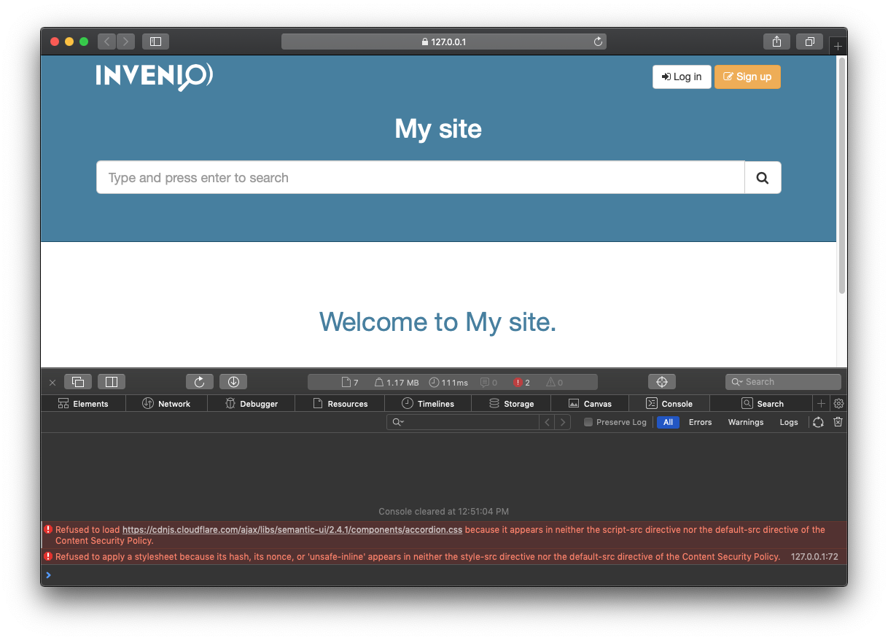

## Tutorial 13 - Securing your Invenio instance

In this session, we will discover the key points which will ensure that your Invenio instances are secure. We will learn how to protect the web application with configuration, package management and authentication. We will explore with small exercises on how the vulnerabilities can be exploited due to misconfiguration or security issues.

Jump to: [Step 1](#step-1) | [Step 2](#step-2) | [Step 3](#step-3) | [Step 4](#step-4)

Any extra long description

## Step 1

Start from a clean and working instance:

```bash
$ cd 13-securing-your-invenio-instance/
$ ./init.sh
```

## Step 2

You should update our `APP_ALLOWED_HOSTS` to the correct value in our production instances. If you try to make a request with different host header than this one you will not be able to get a response.

```console
$ curl -ki -H "Host: test" https://127.0.0.1:5000/api/records/
HTTP/1.0 400 BAD REQUEST
Content-Type: application/json
Content-Length: 56
X-Frame-Options: sameorigin
X-XSS-Protection: 1; mode=block
X-Content-Type-Options: nosniff
Content-Security-Policy: default-src 'self'; object-src 'none'
X-Content-Security-Policy: default-src 'self'; object-src 'none'
Strict-Transport-Security: max-age=31556926; includeSubDomains
Referrer-Policy: strict-origin-when-cross-origin
Server: Werkzeug/0.14.1 Python/3.6.7
Date: Wed, 13 Mar 2019 05:35:18 GMT

{"message":"Host \"test\" is not trusted","status":400}
```

Lets say now that you allow now  any host in `my_site/config.py`:

```diff
 #: provided, the allowed hosts variable is set to localhost. In production it
 #: should be set to the correct host and it is strongly recommended to only
 #: route correct hosts to the application.
-APP_ALLOWED_HOSTS = ['my-site.com', 'localhost', '127.0.0.1']
+APP_ALLOWED_HOSTS = ['*']

 # OAI-PMH
 # =======
```

Now potential attackers could inject a host header and make all your self links point to their evil site:

```console
$ curl -ki -H "Host: evil.io" https://127.0.0.1:5000/api/records/
TODO this should show a link to attacker.com/aleluya blocked by error in Flask-Talisman
```

## Step 3 : Change secret key

Change in `my_site/config.py` your `SECRET_KEY` and store it safely with only one user with read permissions:

```diff
 #: Secret key - each installation (dev, production, ...) needs a separate key.
 #: It should be changed before deploying.
-SECRET_KEY = 'CHANGE_ME'
+SECRET_KEY = '<strong-randomly-generated-key>'
 #: Max upload size for form data via application/mulitpart-formdata.
 MAX_CONTENT_LENGTH = 100 * 1024 * 1024  # 100 MiB
 #: Sets cookie with the secure flag by default
```

## Step 4: change your certificates

Invenio works only with HTTPS so we create temporary certificates when starting new instances, **these certificates need to be updated**.

## Step 5: Update WSGI_PROXY

The `docker-compose.full.yml` represents the common way Invenio is deployed, with two reverse proxies in front of the application. If you have a different number of proxies in front you should update your `WSGI_PROXY`, for more information read [here](https://invenio-base.readthedocs.io/en/latest/api.html#invenio_base.wsgi.wsgi_proxyfix).

## Step 6: Invenio HTTP headers walk-through

```console
$ curl -kI  https://127.0.0.1:5000/api/records/
HTTP/1.0 200 OK
Content-Type: application/json
Content-Length: 293
Link: <https://127.0.0.1:5000/api/records/?page=1&sort=mostrecent&size=10>; rel="self"
X-Frame-Options: sameorigin
X-XSS-Protection: 1; mode=block
X-Content-Type-Options: nosniff
Content-Security-Policy: default-src 'self'; object-src 'none'
X-Content-Security-Policy: default-src 'self'; object-src 'none'
Strict-Transport-Security: max-age=31556926; includeSubDomains
Referrer-Policy: strict-origin-when-cross-origin
X-RateLimit-Limit: 5000
X-RateLimit-Remaining: 4995
X-RateLimit-Reset: 1552654657
Retry-After: 3024
Server: Werkzeug/0.14.1 Python/3.6.7
Date: Fri, 15 Mar 2019 12:07:12 GMT
```
TODO short description.

## Step 7: CSP

Where do we allow content in our Invenio instances to be loaded from?

```diff

+<script src="https://cdnjs.cloudflare.com/ajax/libs/semantic-ui/2.4.1/components/accordion.css"></script>
<div class="container marketing">
  <div class="row">
    <div class="col-lg-12">
-    <h1 class="text-center">Welcome to My site.</h1>
+    <h1 class="text-center" style="color: red;">Welcome to My site.</h1>
  </div>
</div>

```




## Step 7: Keep packages up to date

It is really important that you keep your packages up to date. Since we are using `pipenv` to manage our application we should follow [`pipenv`'s upgrade workflow](https://pipenv.readthedocs.io/en/latest/basics/#example-pipenv-upgrade-workflow)
```console
$ pipenv update --outdated
$ pipenv update [all|specific-outdated-package]
```

`pipenv` also offers a way of checking all your dependencies and spot package versions which have been publicly discovered as vulnerable.

```console
$ pipenv check
```

## Step 8: File uploads

We should be really careful with what we allow users to upload in our instances, since we are serving them back and they could contain malicious code. Some effective methods to avoid these vulnerabilities are:

- White listing MIMETypes, for example [here](https://github.com/inveniosoftware/invenio-files-rest/blob/69a07a7992a548ae1f4f8d12b784a5b2fbbfdd44/invenio_files_rest/helpers.py#L28-L39)
- Sanitizing MIMETypes so they do not get executed on the browser, for example sanitizing HTML files to plain text.
- Serve your files from a different domain with a static server where there are no sessions or anything  to be compromised.

## Step 9: Auth workflows

TODO

## What did we learn

* How to securely configure Invenio
* How Invenio handles CSP rules
* How to keep your Invenio instance up to date and free of vulnerable packages
* How Invenio will takes care of serving files (potential vector of attack) but for now you should take care of it yourself
* How auth workflows work in Invenio
